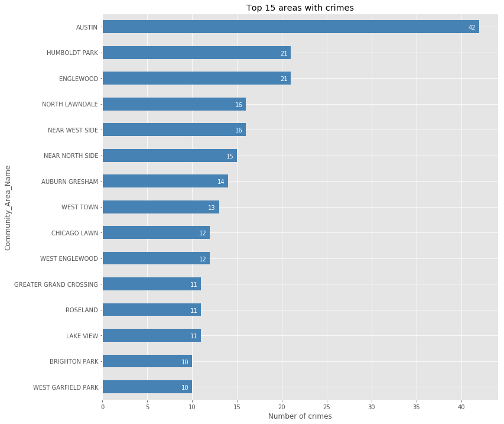
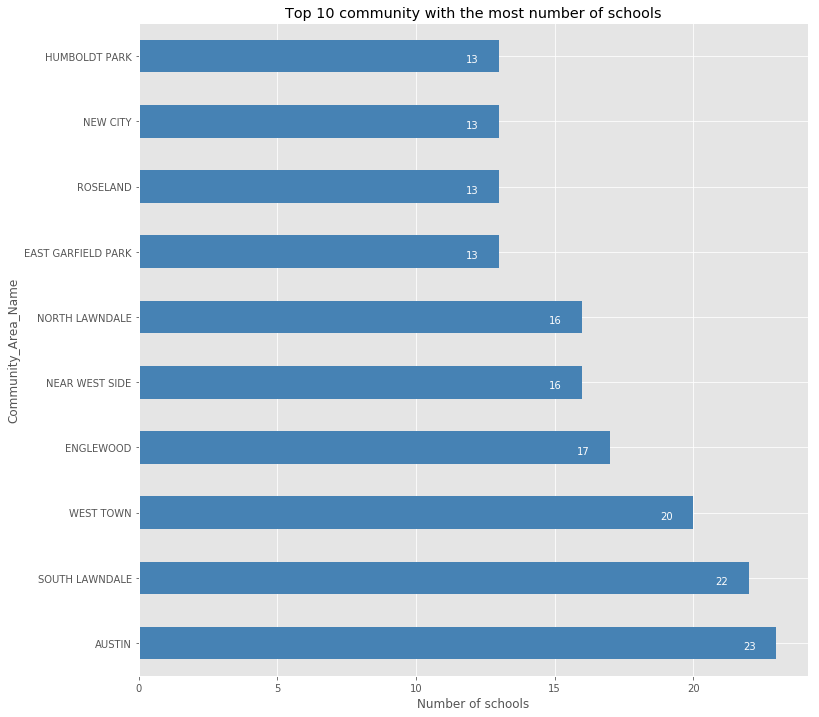
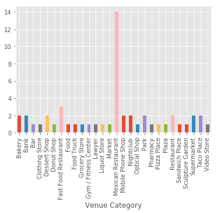

# Final Report – The Battle of the Neighborhoods

## Introduction & Business Problem:
One of the main problems when ones move to a new city is where to find a good neighborhood. This work will be focused on analyzing and visualizing some community of Chicago. A good community will be ones with low rate of crime, healthy schools and high number of public schools. Hopefully, the analysis can give valuable insights about the life of a good community in Chicago (SOUTH LAWNDALE), helping people to make decision when they want to move to Chicago. Popular venues in SOUTH LAWNDALE are also recommend to the users.

The main business accompanied in this work is what are the best areas in Chicago in term of safety and schoools as well as what are different type of venues in those area that one can expect for.

## Data
Two datasets are used:
#### Chicago Public Schools
This dataset shows all school level performance data used to create CPS School Report Cards for the 2011-2012 school year. This dataset is provided by the city of Chicago's Data Portal. For this work I only use a snapshot of this dataset downloaded from: https://ibm.box.com/shared/static/0g7kbanvn5l2gt2qu38ukooatnjqyuys.csv

A detailed description of this dataset and the original dataset can be obtained from the Chicago Data Portal at: https://data.cityofchicago.org/Education/Chicago-Public-Schools-Progress-Report-Cards-2011-/9xs2-f89t

#### Chicago Crime Data

This dataset reflects reported incidents of crime (with the exception of murders where data exists for each victim) that occurred in the City of Chicago from 2001 to present, minus the most recent seven days.

For this assignment I will use a smaller sample of this dataset which can be downloaded from: https://ibm.box.com/shared/static/svflyugsr9zbqy5bmowgswqemfpm1x7f.csv

A detailed description of this dataset and the original dataset can be obtained from the Chicago Data Portal at: https://data.cityofchicago.org/Public-Safety/Crimes-2001-to-present/ijzp-q8t2

## Methodology
### Stage 1 - Business Understanding

As stated in the previous section of this report, our main goal is to search for where is the best area in Chicago in term of safety and schools.

### Stage 2 - Analytic Approach

To decide the ideal community, we must first identify which are the most violent areas in Chicago based on the Crime Data. The areas are then visulized on the map so users can be awared of those. Next, community with high number of schools which is idealy to live is presented to the users.

### Stage 3 - Data Requirements
The data required for this work is described in the Data section. Those datasets were download and then stored in the IBM Db2 database for latter usage.
Apart from that, venues information provided by FourSquare is used also to give users an overview of their future ideal community.

## Results
### The most violent community in Chicago

### The top 10 community with highest number of schools

### Venues in SOUTH LAWNDALE

### Discussion
This work only shows one area of Chicago while there are plenty of other places which also need to be explore. The procedure for analysing different community also need to be made automatic.

### Conclusion
Having to move to a big city will never be easy. In this work, SOUTH LAWNDALE has been showed to be one of the best community for living in Chicago. Popular venues in this areas are also presented.
